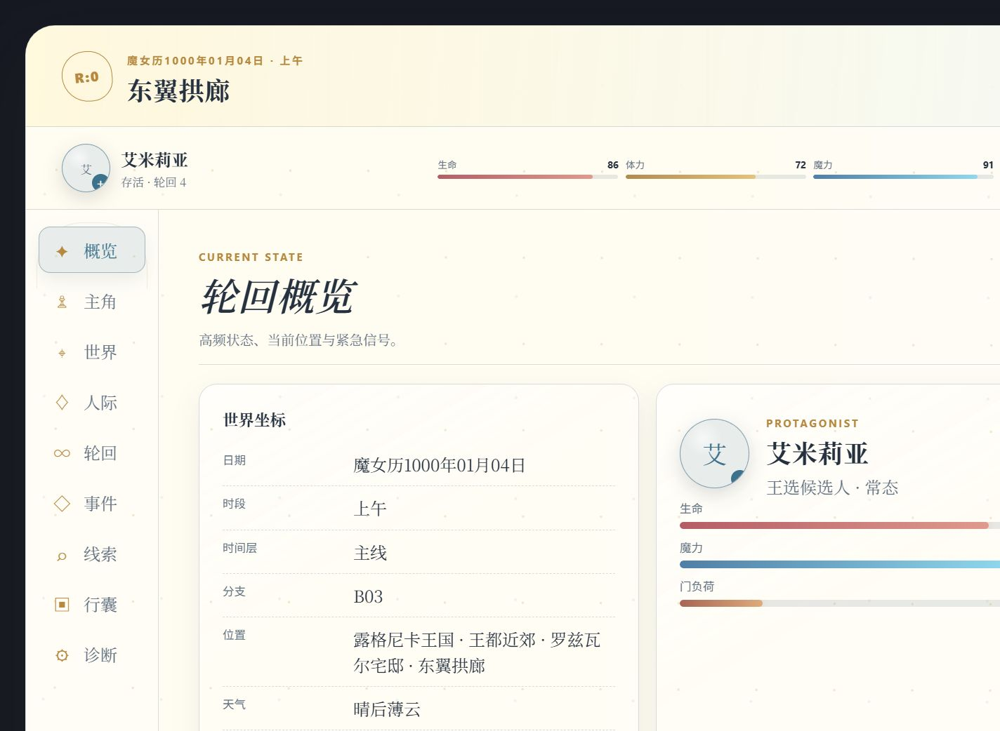

# Re:Zero 全变量状态栏离线浏览器验收

- 验收日期：2026-08-15
- 初次验收实现：`a8789326e5bf1ec597dd2f407bc697519e66dc44`
- 背景可见性修复复验：`857c30434e79118ac1bd6be4d0fd394855717d97`
- 浏览器：Codex 内置 Chromium 浏览器
- 预览入口：`http://127.0.0.1:43174/?assets=local`
- 说明：计划端口 4174 已被仓库中的另一预览占用，因此本次使用 43174，未中断既有进程。

## 结论

离线预览范围内通过。状态栏在宽屏与 320px 窄屏均无页面级横向溢出，九个分区、三态主题控制、人物抽屉、头像编辑、轮回敏感信息折叠、异常数据降级与恶意文本惰性渲染均符合约定。浏览器控制台未记录 warning 或 error。

本报告不等同于真实 SillyTavern 验收；宿主接口、消息楼层、MVU 事件与聊天切换仍需使用本报告对应的最终 regex 产物在真实运行环境核验。

## 视口与初次 QA 截图

- 宽屏：1440 × 1000 CSS px；截图实际内容宽度 1424 px（扣除浏览器滚动条）。
- 窄屏：320 × 900 CSS px；也覆盖了从 640px 宿主宽度进行 200% 缩放时的等效重排宽度。
- 减少动态：模拟 `prefers-reduced-motion: reduce`，状态栏动画与过渡降至近零时长。

## 已检查行为

- 常驻概览：地点、时间、主角身份、生命/体力/魔力/精神稳定仪表、展开与收起。
- 分区导航：概览、主角、世界、人际、轮回、事件、线索、行囊、诊断九项均可选择，标题与内容正确；方向键可循环切换。
- 日夜模式：自动日间、手动夜间、恢复自动均可用；宽图和移动图均成功加载。本地验收使用 `?assets=local`，生产包使用固定提交的 GitHub Raw URL。
- 人际交互：人物卡、类别筛选和完整人物抽屉可用；320px 下抽屉变为容器内底部面板。
- 轮回信息：存档快照默认隐藏，确认后只读展示六个根域；死亡记录默认折叠，可单独展开。
- 头像：姓名首字回退、本地文件选择、裁剪、1.2 倍缩放、WebP/IndexedDB 保存、移除均成功；HTTPS URL 输入可用，HTTP 被拒绝，失效 HTTPS 图片回退为姓名首字。
- 头像范围：没有当前聊天 ID 时默认选择共享库，并禁用“当前聊天覆盖”；不会选中一个不可用的选项。
- 键盘与焦点：Escape 关闭头像弹窗并将焦点还给触发头像；主要按钮的可见尺寸不小于 44px。
- 窄屏：九个分区在 420px 以下变为 3 × 3 网格，全部选项直接可见；导航与文档均无横向溢出。

## 韧性与安全夹具

通过 `fixture=empty|malformed|stale|hostile` 检查：

- `empty`：空状态安全渲染，主角显示“未记录”。
- `malformed`：错误类型被归一化，不导致页面崩溃。
- `stale`：显示“数据旧”提示并保留最后可用状态。
- `hostile`：`` 与拆分构造的 `<script>` 字符串仅作为文本显示；未产生注入节点，`window.pwned` 未被设置。
- 失效远程头像：图片元素失败后移除，姓名首字仍可见。

## 本轮通过 RED–GREEN 关闭的问题

1. 无聊天 ID 时，头像范围曾同时选中共享与被禁用的聊天覆盖；增加纯函数回归测试后修正。
2. 离线预览缺少空、畸形、旧数据与恶意字符串入口；增加独立夹具选择器及打包安全测试。
3. 窄屏标签轨道暴露原生滚动条；补充回归断言，并在极窄容器改为 3 × 3 可点击网格。
4. 场景图片虽成功下载，却因 `z-index: -2` 位于不透明状态栏背景之后而不可见；新增绘制层回归断言，将场景/装饰层移入状态栏自身 stacking context，并降低内容表面的遮罩强度。随后用生产 GitHub Raw URL 复验日间、夜间、宽屏和移动端图片均可见。

## 待真实宿主确认

- Tavern Helper `getVariables` 是否读取到当前消息楼层。
- MVU 初始化与 `VARIABLE_UPDATE_ENDED` 后是否只刷新一次且不重复挂载。
- 编辑消息、重新生成、页面刷新与聊天切换后的状态和头像作用域。
- CDN 失败、MVU 缺失、宿主 320px 容器、浏览器 200% 缩放与真实辅助技术焦点行为。
